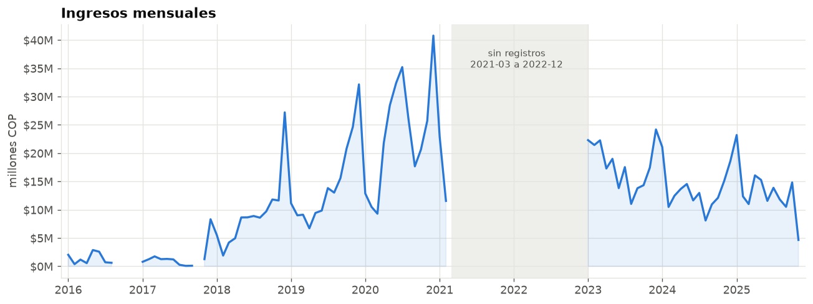

# SpecialModz · Sales data cleaning & analysis

*[Versión en español →](README.md)*

End-to-end data project on the customer database of **SpecialModz**, a Colombian
**game-controller modding and repair** workshop. It starts from an 8-year Excel
sheet full of free text and ends in a clean dataset, a set of metrics and a
business-recommendations report.

> **Privacy.** The source has ~4,300 real customer names. None of it is
> published: the original Excel and the intermediates are in `.gitignore`, and
> the only dataset in the repo (`data/processed/ventas.csv`) has names replaced
> by **pseudonyms** that are consistent per customer
> ([`src/anonimizar.py`](src/anonimizar.py)). Compliant with Colombia's Law
> 1581/2012.

---

## What's in the repo

| Stage | Script | Input → output |
|---|---|---|
| 1. Cleaning | [`src/limpieza_clientes.py`](src/limpieza_clientes.py) | raw Excel → tabular CSV (5 columns) |
| 2. Simulation | [`src/generar_sinteticos.py`](src/generar_sinteticos.py) | real 2024 → projection Jul-2024 to Nov-2025 |
| 3. Integration | [`src/integrar_database.py`](src/integrar_database.py) | + `id_cliente` by first-purchase order |
| 4. Anonymisation | [`src/anonimizar.py`](src/anonimizar.py) | real names → pseudonyms |
| 5. Analysis | [`src/analisis.py`](src/analisis.py) | CSV → 10 charts + `metricas.json` |

Cleaning (stages 1-3) uses **only the Python standard library** — the `.xlsx` is
read with `zipfile` + `xml.etree`, no `pandas` or `openpyxl`. Analysis (stage 5)
does use `pandas` + `matplotlib`.

```
src/                pipeline code (+ rule dictionaries)
data/processed/     published dataset (anonymised) + data dictionary
data/raw/           source — NOT versioned (privacy)
reports/figuras/    the 10 charts (PNG)
docs/               methodology, incident report, analysis & recommendations
sql/                reference schema and load (SQL Server)
dashboard/          one-page HTML dashboard
```

## The cleaning problem

The `TIPO DE VENTA` column was free text: **3,355 distinct values** across 4,173
rows, with several services mixed in one cell, abbreviations and typos
(`MANTENIMIENTO` shows up as `MTTO`, `MTO`, `MANTEMNIMIENTO`…). It was solved
with a **rule dictionary** ([`src/diccionario_tipos.py`](src/diccionario_tipos.py))
that splits each cell, classifies each fragment into one of 3 categories
(`SERVICIO TECNICO`, `MODIFICACION PROPIA`, `COMPRA DE CONTROL`) and **does not
guess**: anything unrecognised goes to a report for manual review.

Also: 228 hand-typed dates (`13/4/2019`, `' 24/05/2018'`), 343 city variants
corrected against a municipality list, and rows without a value excluded. Full
detail in [`docs/metodologia_limpieza.md`](docs/metodologia_limpieza.md) (Spanish)
and [`docs/reporte_incidencias.md`](docs/reporte_incidencias.md).

**Result:** 98 % of orders recovered → 5,996 clean rows (one per order-type),
with the revenue total preserved.

## Key findings

<p align="center">
  <br>
  
</p>

1. **Bogotá concentration** — 74 % of orders (≈99 % in 2024).
2. **Modding is the engine** — 50 % of revenue, highest unit ticket. Technical
   service is high volume / low value: it works as the hook.
3. **Organic cross-sell** — 40 % of orders combine 2-3 types; the
   *controller + modification* combo is the most frequent.
4. **Strong seasonality** — December ≈ 2× March; trough in Feb-Apr.
5. **Transactional base** — only 13 % of customers return (floor), but they bring
   22 % of revenue.

→ Full analysis with actionable recommendations:
**[`docs/analysis_and_recommendations.md`](docs/analysis_and_recommendations.md)**
· dashboard: **[`dashboard/index.html`](dashboard/index.html)**

## Reproduce

```bash
python3 -m venv .venv && source .venv/bin/activate
pip install -r requirements.txt
./run.sh
```

`run.sh` regenerates the analysis and charts from the repo's anonymised CSV.
Stages 1-4 (cleaning and anonymisation) need the original Excel in `data/raw/`
and are skipped if it isn't there.

## Stack

Python 3 (`pandas`, `matplotlib`) · the cleaning pipeline is *zero-dependency* ·
HTML/CSS/JS for the dashboard · SQL Server for the reference schema.

## Note

Data from Jul-2024 onward is a **simulation** shaped like 2023-2024 (the real
source ends 2024-07-03); it is integrated without a per-row flag by project
decision, and the structural conclusions rest on the real range. See
[`docs/datos_sinteticos_2024.md`](docs/datos_sinteticos_2024.md).

## License

Code under [MIT](LICENSE). Anonymised business data, for portfolio purposes only.
