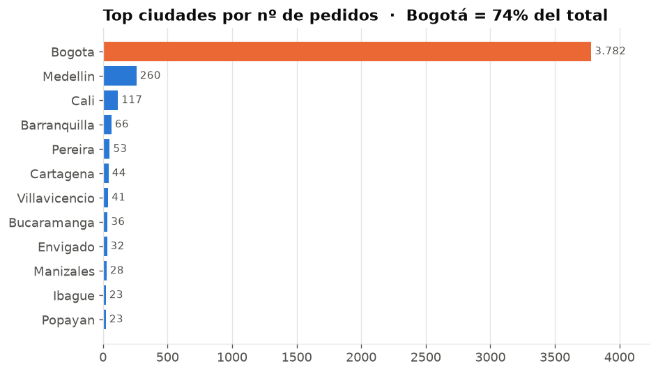
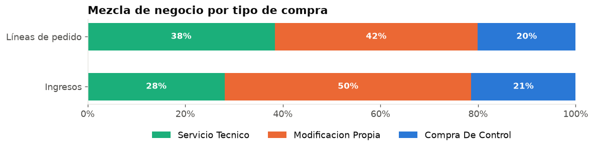
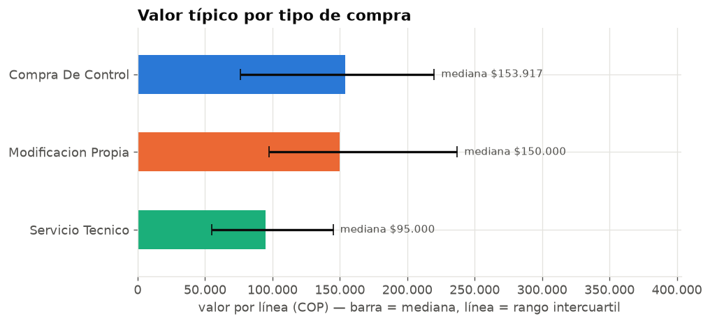
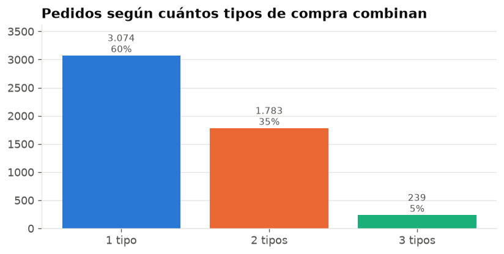
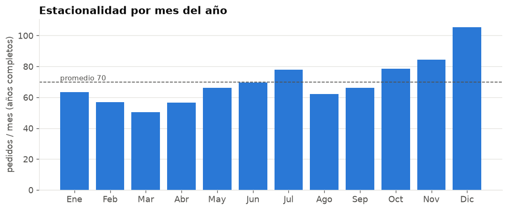
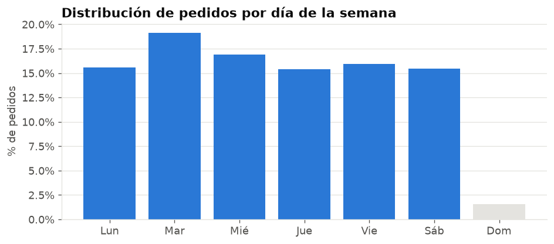
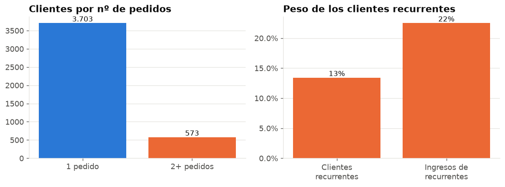

# Analysis & recommendations — SpecialModz

> Colombian workshop for **game-controller modding and repair**.
> This document summarises what the cleaned database
> (`data/processed/ventas.csv`) shows and turns each finding into an action.
>
> Figures produced by [`src/analisis.py`](../src/analisis.py) →
> [`docs/metricas.json`](metricas.json). Charts in
> [`reports/figuras/`](../reports/figuras).

## Data coverage (read first)

| Range | Source | Note |
|---|---|---|
| 2016-01 → 2021-02 | real records | workshop ramp-up |
| 2021-03 → 2022-12 | **no data** | 22 months not recorded in the source |
| 2023-01 → 2024-07-03 | real records | mature operation |
| 2024-07-04 → 2025-11-10 | **simulation** | resampling of real 2024 orders with seasonality; see [`datos_sinteticos_2024.md`](datos_sinteticos_2024.md) |

The totals here (7,433 lines · 5,096 orders · 4,276 customers · COP 1,152 M) mix
both ranges. The structural reads (business mix, seasonality, geography, ticket
size) rest on the **~4,100 real orders**; the simulation only extends the shape
of 2023-2024 and changes none of the conclusions. **Repeat-rate** figures are a
**floor** (see §5).

---

## 1. The business is almost entirely Bogotá

- **74 %** of orders are from Bogotá; in the 2024 slice it rises to ~99 %.
- Orders come from 196 municipalities, but the tail is tiny: Medellín (2nd) and
  Cali (3rd) together are under 7 %.

**Recommendation**
- **Go deeper in Bogotá**, where the shop already wins: referral program,
  repeat-purchase, partnerships with neighbourhood game stores / gaming cafés.
- **National-shipping pilot** to Medellín and Cali with courier pickup/return.
  It answers a question the data can't: outside Bogotá, is demand low, or is
  logistics simply missing?

## 2. Modding drives revenue; repair is the hook

| type | % of lines | % of revenue | median value / line |
|---|--:|--:|--:|
| Own modification | 42 % | **50 %** | COP 150,000 |
| Technical service | 38 % | 28 % | COP 95,000 |
| Controller purchase | 20 % | 21 % | COP 154,000 |

- **Own modification** generates half the revenue at the highest unit ticket: it
  is the product to push.
- **Technical service** is high volume, low value per line: it works as an
  **entry point** for new customers more than as a margin source.

**Recommendation**
- Counter script to **upsell from service to modification**: when a controller
  comes in for maintenance, offer the upgrade (rapid triggers, anti-slip,
  buttons). The bridge already exists — see §3.
- Measure **margin** by type (cost is missing from the data) to confirm modding
  is not just higher ticket but higher profit.

## 3. 4 in 10 orders already combine several services

- **40 %** of orders include 2 or 3 purchase types.
- Most frequent combos: **controller + modification** (932 orders) and
  **modification + service** (741). Whoever buys a controller almost always has
  it modded.

**Recommendation**
- Formalise the **"new controller + modification"** combo as a single SKU with a
  bundle price. It already happens organically in ~1 of every 5 orders; making it
  an explicit offer raises ticket size and streamlines the workshop.
- **"Maintenance + 1 upgrade"** bundle with a small discount, aimed at the base
  that has only ever paid for technical service.

## 4. Strong seasonality: December is double March

- Peak in **November-December-January** (gifts and year-end bonus); trough in
  **February-April**. December ≈ **2×** March. Secondary bump in July.
- **Sunday** the shop barely operates (0.5 %); **Tuesday** is the busiest day.

**Recommendation**
- Plan **inventory and staffing** by season: reinforce purchasing and shifts in
  Oct-Dec; don't over-hire in Q1.
- **Low-season promotion** (Feb-Apr) to level the workshop's workload and reduce
  dependence on the year-end spike.

## 5. Very transactional base — repeat purchase is the cheap opportunity

- Only **13 %** of customers return (recorded), and that group brings **22 %** of
  revenue: a returning customer is worth ~**1.9×** one who doesn't.
- This 13 % is a **floor**: the source has no phone or ID, so two visits by the
  same person with the name spelled differently count as two customers, and the
  2021-2022 gap breaks histories. Real repeat purchase is higher.

**Recommendation**
- **Capture phone or ID** on every order (see §6). Without an identifier there is
  no way to measure retention, LTV, or run campaigns.
- **Maintenance reminder** every 6-12 months over WhatsApp. Low-cost incremental
  revenue on a base of 4,000+ customers.

## 6. What to change in data capture (what this project makes obvious)

The current Excel sheet took rule-by-rule work to recover 98 % of the orders:
`TIPO DE VENTA` held **3,355 distinct strings** across 4,173 rows, 228
hand-typed dates and 343 city variants (see
[`reporte_incidencias.md`](reporte_incidencias.md)).

**Recommendation — a form with structured fields** (Google Forms, AppSheet, or a
simple POS):

| Field | How to capture it |
|---|---|
| Date | automatic |
| Customer | name **+ phone** (phone is the ID) |
| City | municipality dropdown |
| Sale type(s) | **checkboxes**: ☐ technical service ☐ modification ☐ controller purchase |
| Detail | free text, separate, doesn't affect the category |
| Value | one row per type, not a total to split |

This removes ~90 % of future cleaning work and enables everything in §5. The
3-category catalogue and the dictionary in
[`src/diccionario_tipos.py`](../src/diccionario_tipos.py) serve as the standard.

## 7. Next analytics (once there is a real customer ID)

- **Retention cohorts** and **LTV** by first-purchase month.
- **RFM** (recency / frequency / monetary) to segment the base and prioritise
  campaigns.
- **Margin by type and by combo** — needs parts and labour cost added to capture.
- **Price elasticity** of the controller + modification combo.

---

### Showcase summary

| Metric | Value |
|---|--:|
| Orders analysed | 5,096 |
| Unique customers | 4,276 |
| Total revenue (real + simulated) | COP 1,152,812,212 |
| Median ticket per order | COP 175,000 |
| Bogotá share | 74 % |
| Own-modification revenue | 50 % |
| Orders with 2+ types | 40 % |
| Repeat customers (floor) | 13 % → 22 % of revenue |
| Peak / trough month | December / March |
